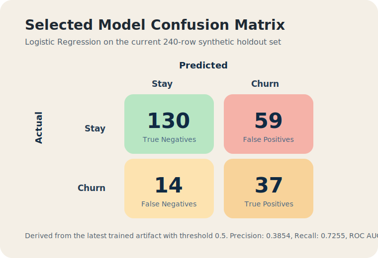
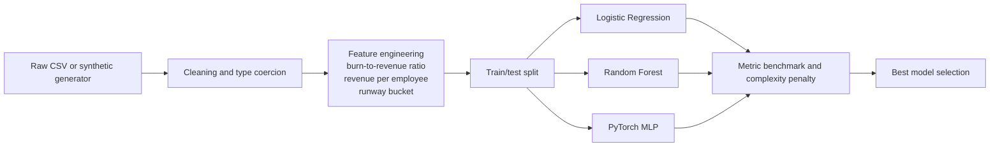
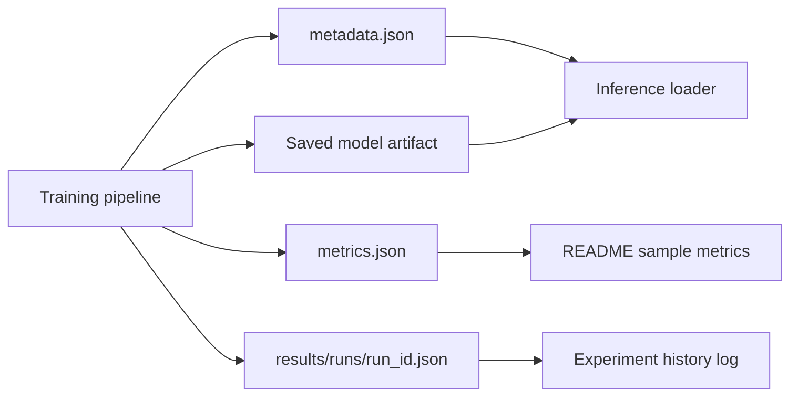

# Startup Churn Classifier

This project packages an end-to-end binary classification workflow for startup churn prediction. It handles messy tabular input, benchmarks multiple model families, persists the selected model, and serves predictions through FastAPI in a Docker-friendly shape.

## Stack

- Python
- Pandas and NumPy for cleaning, coercion, and imputation-ready feature preparation
- Scikit-learn for preprocessing, Logistic Regression, and Random Forest baselines
- PyTorch for a feed-forward MLP benchmark
- FastAPI for inference
- Docker for packaging

## What the project does

- Generates a messy startup dataset if `data/raw/startup_churn.csv` is missing.
- Cleans inconsistent currencies, percentages, booleans, mixed casing, and missing values.
- Trains three models and compares them on precision, recall, and ROC AUC.
- Applies a small complexity penalty so the final selection reflects resource-sensitive deployment trade-offs.
- Saves the selected model into `artifacts/` and exposes it through an HTTP API.
- Logs each training run under `results/` with metrics, hyperparameters, and artifact versions.
- Validates API payloads with strict Pydantic schemas so malformed fields fail with clear 422 responses.
- Emits structured JSON logs for each API request and returns an `X-Request-ID` header for request tracing.
- Exposes `/metrics` with in-memory request, error-rate, and inference-volume counters for monitoring hooks.
- Engineers higher-signal model features including burn-to-revenue ratio, revenue per employee, and runway buckets.

## Project structure

```text
startup_churn_classifier/
  api/
  models/
data/
  raw/
artifacts/
results/
tests/
train.py
Dockerfile
```

## Local setup

```bash
python -m venv .venv
.venv\Scripts\activate
pip install -e .[dev]
startup-churn train
startup-churn serve --reload
```

## Task Runner

Use the lightweight task runner for common workflows:

```bash
python tasks.py install
python tasks.py train
python tasks.py serve
python tasks.py test
python tasks.py docker-build
```

Each training run also writes:

- `results/runs/<run_id>.json` for the full run record
- `results/experiments.jsonl` as an append-only history log
- `results/latest.json` for the newest experiment snapshot

## Sample Results

The latest local training run on the fixed synthetic split selected `logistic_regression` as the deployment model.

| Model | Precision | Recall | ROC AUC | Selection Score |
| --- | ---: | ---: | ---: | ---: |
| Logistic Regression | 0.3854 | 0.7255 | 0.7705 | 1.0522 |
| PyTorch MLP | 0.4337 | 0.7059 | 0.7550 | 0.9471 |
| Random Forest | 0.5238 | 0.2157 | 0.7449 | 0.8190 |

Holdout confusion matrix for the selected model:



The current holdout set contains 240 rows: 189 non-churn examples and 51 churn examples. The selected model produced 130 true negatives, 59 false positives, 14 false negatives, and 37 true positives.

## Architecture

### Training Flow



### Artifact Flow



### API Serving Flow

```mermaid
flowchart LR
    A[Client request] --> B[FastAPI validation]
    B --> C[Request ID middleware and structured logging]
    C --> D[Shared preprocessing and feature engineering]
    D --> E[Loaded model artifact]
    E --> F[/predict response]
    C --> G[/metrics counters]
    C --> H[JSON logs]
```

## API usage

## Dashboard

Open `http://127.0.0.1:8000/` after starting the app to use the dashboard. It includes:

- a live prediction form wired to `/predict`
- model leaderboard and deployed artifact metrics from `/dashboard/summary`
- live monitoring cards sourced from `/metrics`

`POST /predict`

```json
{
  "company_age_months": "24",
  "monthly_burn_usd": "$120,000",
  "runway_months": "10",
  "team_size": 18,
  "founder_exits": 0,
  "customer_growth_pct": "12%",
  "support_tickets_last_30_days": 14,
  "annual_revenue_usd": "$1,900,000",
  "market_segment": "SaaS",
  "growth_stage": "Series-A",
  "remote_friendly": "yes",
  "investor_tier": "tier-2-vc"
}
```

Example response:

```json
{
  "selected_model": "random_forest",
  "churn_probability": 0.2143,
  "predicted_label": 0
}
```

Invalid payloads now fail early at the API boundary. Examples include malformed numeric strings, unsupported categorical values, and unexpected extra fields.

`GET /metrics`

Returns a monitoring snapshot with total requests, request error rate, total predictions, prediction error rate, latency averages, and per-status / per-path counters.

## Tests

```bash
pytest
```

## Docker

```bash
docker build -t startup-churn-classifier .
docker run -p 8000:8000 startup-churn-classifier
```

## CI

This repository is installable with `pyproject.toml`, so local setup, CI, and Docker use package installs rather than a loose script path.

GitHub Actions runs `startup-churn train`, `pytest`, and a Docker image build on pushes to `main` and on pull requests. The workflow lives in `.github/workflows/ci.yml`.
